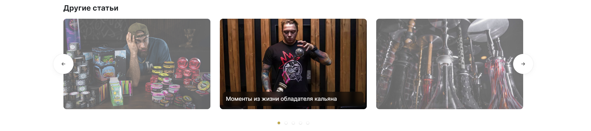

# Документация к слайдеру перелинковки
Такой используется в [детальной странице блога](https://hookah-time.shop/blog/sovety-ot-ekspertov-hookah-time/kak-chasto-nado-myt-kalyan-vliyanie-zagryazneniya-na-zdorove/), в детальной карточке товара, 
может быть где-то ещё, но я не помню.

## Внешний вид слайдера
### Десктоп


### Мобилка


## HTML-шаблон слайдера
```php
?>
<div class="mediamint__centered-slider-wrapper">
    <div class="swiper-container medimint__centered-slider detail-blog-linked-articles">
        <div class="swiper-wrapper">
            <? foreach ($arResult["LINKED_ARTICLES"] as $arItem) {
                if ($arItem["PREVIEW_PICTURE"]["SRC"] !== "") { ?>
                    <a href="<?=$arItem["DETAIL_PAGE_URL"]?>"
                       title="<?=$arItem["NAME"]?>"
                       class="swiper-slide">
                        "
                             alt="<?=$arItem["PREVIEW_PICTURE"]["ALT"]?>">

                        <p class="font-title mediamint__centered-slider-item__name">
                            <?=$arItem["NAME"]?>
                        </p>
                    </a>
                <? }
            } ?>
        </div>
    </div>

    <div class="swiper-navigation mediamint__swiper-navigation detail-blog-linked-articles__navigation">
        <div class="swiper-button-prev"></div>
        <div class="swiper-button-next"></div>
    </div>
</div>

<div class="swiper-pagination mediamint__swiper-pagination detail-blog-linked-articles__pagination"></div>
```

## Инициализация слайдера
```js
// реализация в <шаблон_сайта>/custom.js
initCenteredSlider(
  ".swiper-container.detail-blog-linked-articles",
  ".detail-blog-linked-articles__navigation",
  ".detail-blog-linked-articles__pagination"
);
```
или

```js
const swiperSelector = ".swiper-container.detail-blog-linked-articles";
const swiperNavigationSelector = ".detail-blog-linked-articles__navigation";
const swiperPaginationSelector = ".detail-blog-linked-articles__pagination";

// реализация в <шаблон_сайта>/custom.js
initCenteredSlider(
    swiperSelector, 
    swiperNavigationSelector, 
    swiperPaginationSelector
)
```

**Функция инициализации** лежит в<br>
``<шаблон_сайта>/custom.js``
### Параметры функции
* ``swiperSelector`` - дополнительный CSS-класс, который вешается на элемент 
``.swiper-cotainer`` (или ``.swiper`` для новых версий слайдера)
* ``swiperNavigationSelector`` - дполнительный CSS-класс, который вешается на 
  блок, оборачивающий кнопки "Вперед" и "Назад".
* ``swiperPaginationSelector`` - дополнительный CSS-класс, который вешается 
  на элемент пагинации вместе со ``.swiper-pagination``.

**Классы, начинающиеся с префикса ``mediamint__`` в этом слайдере отвечают за 
стилизацию, их удалаять нельзя**

**Стандартные стили для слайдера** лежат в<br>
``/www/hookah-time.shop/bitrix/templates/alpha_s1/less/custom.less``
и начинаются с префиксов ``mediamint__``

&copy; Mediamint, 2023

